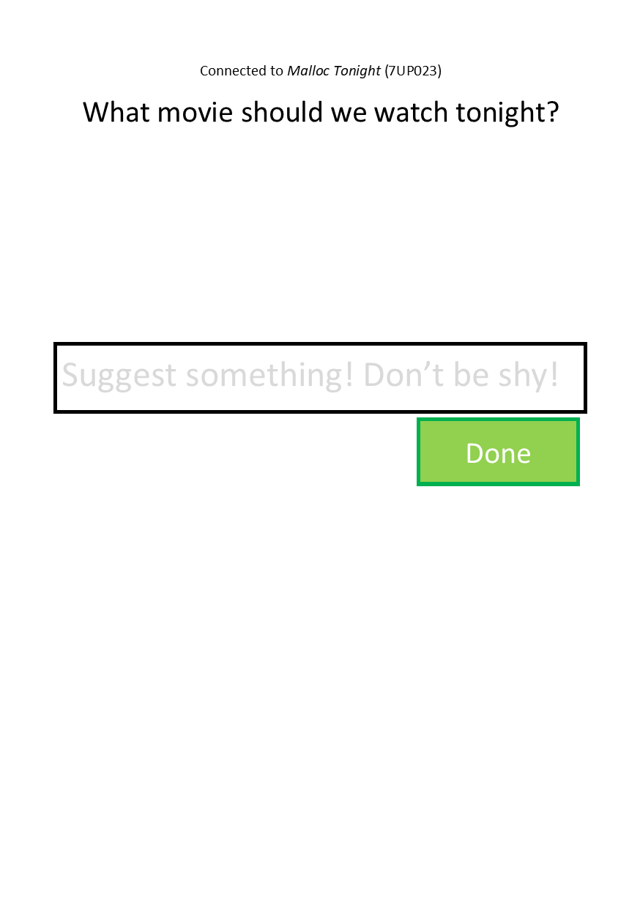

= Web Startup for Class

== Elevator Pitch
You have a problem with a lot of potential solutions, and a lot of
people/friends/colleagues want to pitch ideas to you at once. This
website allows all of them to pitch in ideas with their phones
from the same website, using a "host code" system similar to Among
Us and most Jackbox Party Pack games.

Afterward, pick any one idea you like the most...or, if you're
still undecided, pick more than one idea and put it up to a vote.

